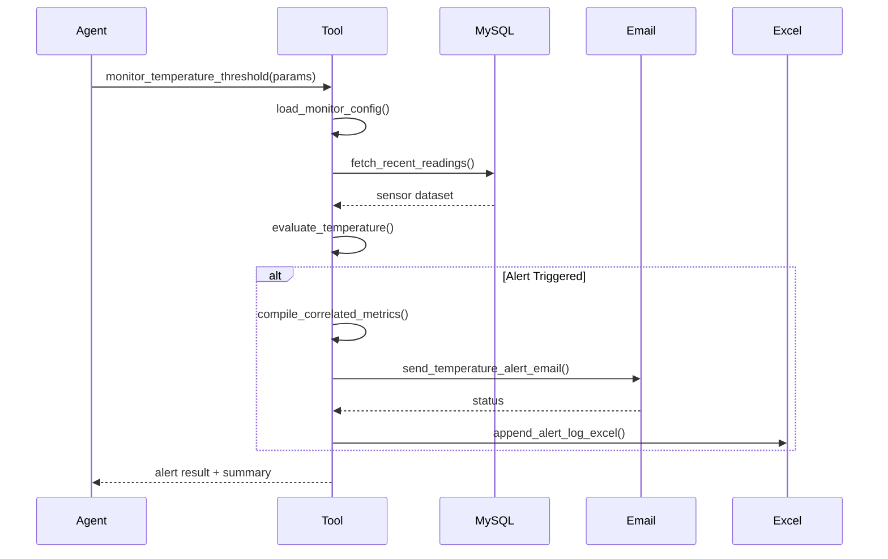
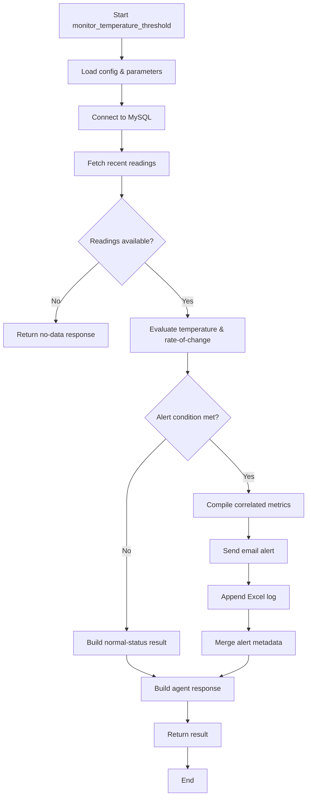

# Temperature Alert Feature Structure

## Function & Module Layout
- `monitor_temperature_threshold(date_range: Optional[str], equipment_ids: Optional[list[str]], threshold: Optional[float]) -> dict`
  - Entry-point `@function_tool`; orchestrates data fetch, threshold checks, alerting, and logging.
- `fetch_recent_readings(conn, equipment_ids, window_minutes) -> list[dict]`
  - Queries `equipment_data` for latest readings filtered by equipment ID and time window.
- `evaluate_temperature(readings, threshold, roc_limit) -> dict`
  - Computes current temperature status, delta, rate-of-change, and determines alert severity.
- `compile_correlated_metrics(readings) -> dict`
  - Summarizes vibration/current/runtime behavior around the alert window.
- `send_temperature_alert_email(alert_payload, email_config) -> bool`
  - Builds and dispatches SMTP email with contextual information.
- `append_alert_log_excel(alert_payload, log_path) -> None`
  - Appends alert metadata into Excel workbook using `pandas`/`openpyxl`.
- `load_monitor_config() -> MonitorConfig`
  - Reads `.env` to assemble thresholds, email recipients, polling intervals.
- `build_agent_response(alert_result) -> str`
  - Formats human-friendly summary for agent replies.

## Flow Overview
1. Agent calls `monitor_temperature_threshold(...)`.
2. Load configuration and normalize parameters.
3. Connect to MySQL and fetch recent sensor readings.
4. Evaluate readings against temperature/rate-of-change thresholds.
5. If alert triggered:
   - Enrich with correlated metrics.
   - Send email notification.
   - Log event in Excel workbook.
6. Return structured result plus agent response text.

## Mermaid Sequence Diagram

## Mermaid Flowchart (UMF-style)

